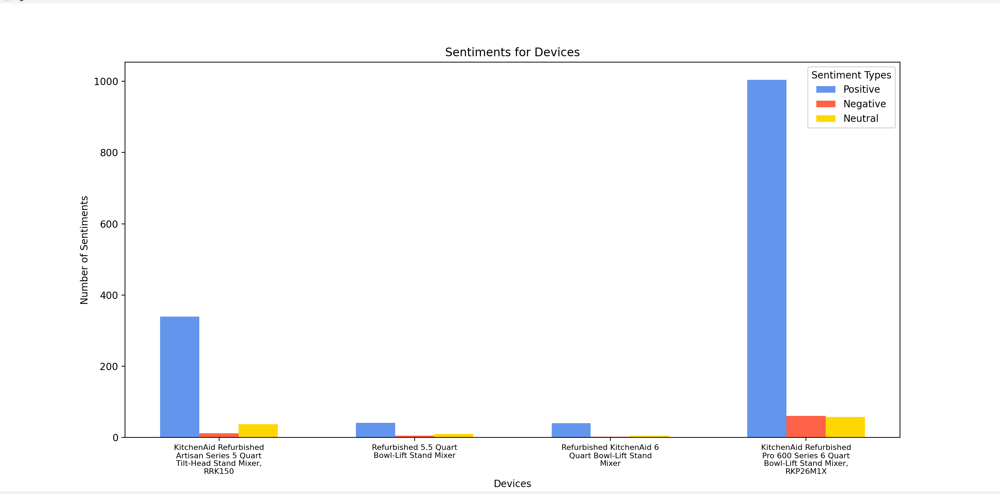

# About this project
This program was written to scrape a website and parse through the content, writing all of the comments of multiple different devices to different files. It then takes each file full of comments and asks Phi3 to describe the review as positive, negative, or neutral. All of these results are also written to a file, each device having their own file once again. The number of positive, negative, and neutral comments are counted and recorded. Once all items have gone through this process, a bar graph that displays the number of positive, negative, and neutral comments there are for each device is created.

## Requirements & how to download
- ### Create an environment
    1. in order to avoid having to manually download all requirements listed following this, you can simply run this command instead to download the necessary requirements to the current environment
        > conda env create -f requirements.yaml

- ### Beautiful Soup
    1. open Command Prompt or an environment in VSCode
    2. run the following commands
        > pip install beautifulsoup4
    
        > pip install bs4

        > pip install lxml
    3. make sure "requests" is installed by running the following command
        > pip install beautifulsoup4 requests
- ### Ollama
    1. go to ollama.com/download/windows
    2. click "Download for Windows (Preview)"
    3. after download is complete, go to Command Prompt or environment in VSCode and run the command
        > ollama
    4. run the following command in order to run directly in the terminal
        > ollama run phi3

        to leave, in the input line type
        > /bye
    5. to use in project run the command
        > pip install ollama
- ### matplotlib
    1. to download run the command
        > pip install matplotlib
- ### NumPy
    1. to download run the command
        > pip install numpy

## To run project3.py
1. create environment with _**requirements.yaml**_ file
    > conda env create -f requirements.yaml

2. make sure _**project3.py**_ and _**urls.txt**_ are in the same folder
3. click run in the _**project3.py**_ file. files consisting of the comments and sentiments will appear along with a bar graph that has the results of the sentiment analysis of the comments

## Example graph output

## Testing project3.py
1. in environment created with _**requirements.yaml**_, download _**test_project3.py**_ and make sure it is in the same folders as the others
2. in the terminal, run the command
    > pytest test_project3.py

3. output will display with the results of the tests

## Troubleshooting
- if Ollama does not work after downloaing, try closing and reopening VSCode or Command Prompt and running the command "ollama" again
- if program is taking too long to run, try quiting and rerunning Ollama (note: the more comments a file has, the longer it will take to run)
